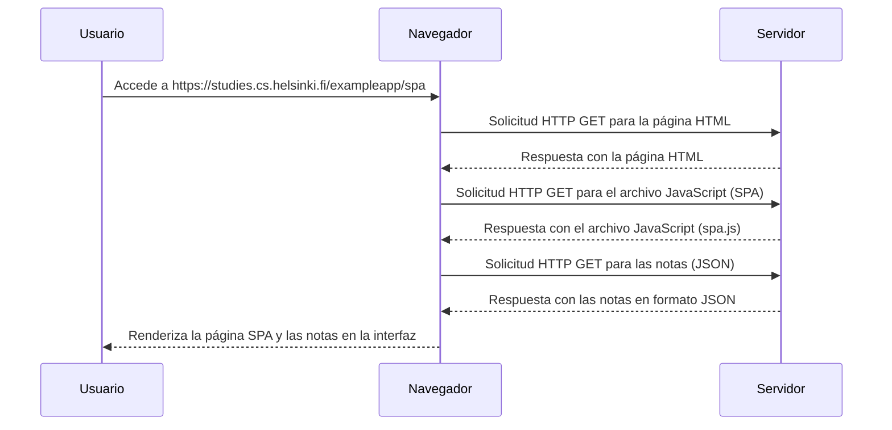

```mermaid
sequenceDiagram
    participant User as Usuario
    participant Browser as Navegador
    participant Server as Servidor

    User->>Browser: Accede a https://studies.cs.helsinki.fi/exampleapp/spa
    Browser->>Server: Solicitud HTTP GET para la página HTML
    Server-->>Browser: Respuesta con la página HTML
    Browser->>Server: Solicitud HTTP GET para el archivo JavaScript (SPA)
    Server-->>Browser: Respuesta con el archivo JavaScript (spa.js)
    Browser->>Server: Solicitud HTTP GET para las notas (JSON)
    Server-->>Browser: Respuesta con las notas en formato JSON
    Browser-->>User: Renderiza la página SPA y las notas en la interfaz
```
